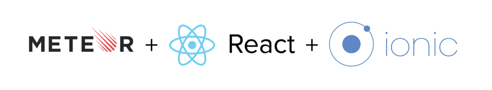

# meteoreact

### Get started

1. Install meteor :
`curl https://install.meteor.com/ | sh`
2. Cut the `styles.scss` and paste it outside the folder
3. In the project folder run meteor : `meteor` (there will maybe an error with scss but don't worry)
4. Stop meteor : `CTRL + C`
5. Paste the `styles.scss` in `client/styles` folder
6. Create an application on facebook (get the id and secret id)
7. Create a settings.json :

{
  "public": {
    "facebook": {
      "AppID": <APP ID>
    }
  },
  "facebook": {
    "AppSecret": <APP SECRET ID>
  }
}

8. Run again meteor : `meteor --settings settings.json`

### Update

* The starter app comes from [here](https://medium.com/@SamCorcos/meteor-react-ionic-mobile-app-part-1-the-basic-template-9355ebf3397f#.o76zpx7ng) thanks to [Sam Corcos](https://github.com/samcorcos).
* This one is an upgraded version with the support of the official react router package, and susbscriptions/publications.
